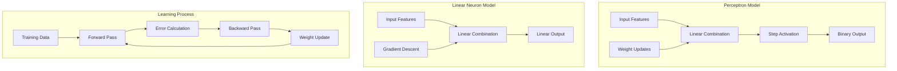
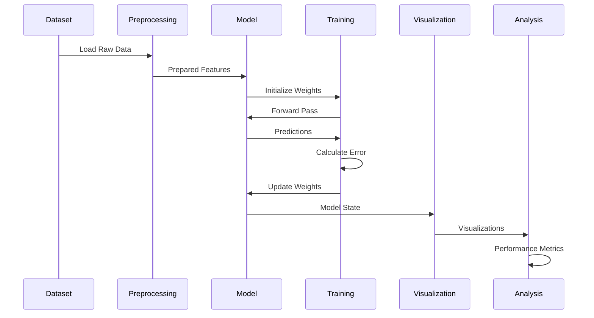

<div align="center"><a name="readme-top"></a>

[](#)

# 🧠 Advanced Neural Network Applications<br/><small>Practical Implementations of Perceptron and Linear Neuron Models</small>

A comprehensive educational repository demonstrating fundamental neural network architectures through practical applications including fish classification and heat influx prediction.<br/>
Features detailed mathematical analysis, step-by-step implementations, and interactive visualizations.<br/>
Perfect for **learning** the foundations of neural networks and machine learning.

[📚 View Notebooks](#-project-notebooks) · [📊 Explore Datasets](#-datasets) · [🚀 Quick Start](#-getting-started) · [📖 Documentation](#-implementation-details) · [🤝 Contributing](#-contributing)

<br/>

[](#-getting-started)

<br/>

<!-- SHIELD GROUP -->
[![][github-license-shield]][github-license-link]
[![][python-shield]][python-link]
[![][jupyter-shield]][jupyter-link]
[![][numpy-shield]][numpy-link]<br/>
[![][github-stars-shield]][github-stars-link]
[![][github-forks-shield]][github-forks-link]
[![][github-issues-shield]][github-issues-link]<br>

**Share Neural Network Knowledge**

[![][share-x-shield]][share-x-link]
[![][share-telegram-shield]][share-telegram-link]
[![][share-linkedin-shield]][share-linkedin-link]

<sup>🌟 Advancing neural network education through practical implementations. Built for students, researchers, and practitioners.</sup>

## 📸 Project Visualizations

> [!TIP]
> Interactive Jupyter notebooks showcase neural network behavior through comprehensive visualizations and step-by-step analysis.

<div align="center">
  
  <p><em>Perceptron Model - Dynamic Classification Boundary Evolution</em></p>
</div>

<div align="center">
  
  
  <p><em>Fish Species Classification (left) and 3D Heat Influx Prediction Surface (right)</em></p>
</div>

<details>
<summary><kbd>📊 More Visualizations</kbd></summary>

<div align="center">
  
  <p><em>Real-time Weight Update Visualization During Training</em></p>
</div>

<div align="center">
  
  <p><em>Comprehensive Error Analysis and Performance Metrics</em></p>
</div>

</details>

**Tech Stack Badges:**

<div align="center">

 
 
 
 
 
 

</div>

</div>

> [!IMPORTANT]
> This project demonstrates foundational neural network concepts through hands-on implementations. It combines theoretical understanding with practical applications, featuring perceptron models for classification and linear neurons for regression tasks. Perfect for educational purposes and research foundations.

<details>
<summary><kbd>📑 Table of Contents</kbd></summary>

#### TOC

- [🧠 Advanced Neural Network ApplicationsPractical Implementations of Perceptron and Linear Neuron Models](#-advanced-neural-network-applicationspractical-implementations-of-perceptron-and-linear-neuron-models)
  - [📸 Project Visualizations](#-project-visualizations)
      - [TOC](#toc)
      - [](#)
  - [🌟 Introduction](#-introduction)
  - [✨ Key Features](#-key-features)
    - [`1` Perceptron Implementation](#1-perceptron-implementation)
    - [`2` Linear Neuron Models](#2-linear-neuron-models)
    - [`*` Educational Components](#-educational-components)
  - [🛠️ Tech Stack](#️-tech-stack)
  - [🏗️ Architecture](#️-architecture)
    - [Neural Network Architecture](#neural-network-architecture)
    - [Project Structure](#project-structure)
    - [Data Flow](#data-flow)
  - [📚 Project Notebooks](#-project-notebooks)
  - [📊 Datasets](#-datasets)
    - [Fish Classification Dataset](#fish-classification-dataset)
    - [Heat Influx Dataset](#heat-influx-dataset)
  - [🚀 Getting Started](#-getting-started)
    - [Prerequisites](#prerequisites)
    - [Quick Installation](#quick-installation)
    - [Launch Jupyter Notebooks](#launch-jupyter-notebooks)
  - [📖 Implementation Details](#-implementation-details)
    - [Perceptron Model](#perceptron-model)
    - [Linear Neuron Model](#linear-neuron-model)
    - [Mathematical Analysis](#mathematical-analysis)
  - [💻 Usage Examples](#-usage-examples)
    - [Fish Classification with Perceptron](#fish-classification-with-perceptron)
    - [Heat Influx Prediction](#heat-influx-prediction)
  - [⌨️ Development](#️-development)
    - [Adding New Models](#adding-new-models)
    - [Extending Visualizations](#extending-visualizations)
  - [🧪 Testing](#-testing)
  - [🤝 Contributing](#-contributing)
    - [Development Process](#development-process)
    - [Contribution Guidelines](#contribution-guidelines)
  - [📄 License](#-license)
  - [👥 Team](#-team)
  - [🙋‍♀️ Author](#️-author)

####

<br/>

</details>

## 🌟 Introduction

We are passionate about advancing neural network education through practical, hands-on implementations. This repository provides comprehensive educational materials demonstrating fundamental neural network architectures including perceptron models and linear neurons through real-world applications.

Whether you're a student learning neural networks, a researcher exploring foundational concepts, or a practitioner seeking implementation references, this project offers detailed mathematical analysis, step-by-step implementations, and interactive visualizations.

> [!NOTE]
> - Python 3.x required
> - Jupyter Notebook environment
> - Basic understanding of linear algebra recommended
> - Mathematical notation and detailed analysis included

| [![][demo-shield-badge]][notebooks-link]   | No installation required! View notebooks directly on GitHub.                           |
| :------------------------------------ | :--------------------------------------------------------------------------------------------- |
| [![][education-shield-badge]][docs-link] | Comprehensive educational materials with mathematical proofs and visualizations. |

> [!TIP]
> **⭐ Star us** to support neural network education and receive updates on new implementations!

[![][image-star]][github-stars-link]

<details>
  <summary><kbd>⭐ Star History</kbd></summary>
  <picture>
    <source media="(prefers-color-scheme: dark)" srcset="https://api.star-history.com/svg?repos=ChanMeng666%2Fadvanced-neural-network-applications&theme=dark&type=Date">
    
  </picture>
</details>

## ✨ Key Features

[![][image-feat-perceptron]][notebooks-link]

### `1` [Perceptron Implementation][docs-perceptron]

Experience comprehensive perceptron model implementation with detailed mathematical analysis. Our approach provides step-by-step weight updates, classification boundary visualization, and convergence analysis through practical fish species classification.

<div align="center">
  
  <p><em>Real-time Perceptron Learning with Boundary Evolution</em></p>
</div>

Key capabilities include:
- 🎯 **Binary Classification**: Fish species identification (Canadian vs Alaskan)
- 📊 **Dynamic Visualization**: Real-time classification boundary updates
- 🔬 **Mathematical Analysis**: Detailed weight update calculations and proofs
- 📈 **Performance Metrics**: Error analysis and convergence tracking

[![][back-to-top]](#readme-top)

### `2` [Linear Neuron Models][docs-linear]

Advanced linear neuron implementations covering single-input and multi-input scenarios for heat influx prediction. Features batch learning algorithms, gradient descent optimization, and comprehensive 3D visualizations.

<div align="center">
  
  
  <p><em>Single-Input Model (left) and Multi-Input Model (right) Comparison</em></p>
</div>

**Available Implementations:**
- **Single-Input Model**: North elevation → Heat influx prediction
- **Multi-Input Model**: North + South elevations → Enhanced prediction accuracy
- **Batch Learning**: Optimized training with gradient descent
- **3D Visualization**: Interactive prediction surface rendering

[![][back-to-top]](#readme-top)

### `*` Educational Components

Beyond core implementations, this project includes:

- [x] 📚 **Comprehensive Documentation**: Step-by-step mathematical derivations
- [x] 🎨 **Interactive Visualizations**: Dynamic plots and 3D rendering capabilities  
- [x] 🔬 **Detailed Analysis**: Error metrics, R² scores, and performance comparisons
- [x] 📊 **Real Datasets**: Fish measurement and building thermal data
- [x] 🧮 **Mathematical Proofs**: Complete derivations of learning algorithms
- [x] 💡 **Educational Annotations**: Extensive comments and explanations
- [x] 🔄 **Reproducible Results**: Deterministic implementations with seed control
- [x] 📱 **Notebook Format**: Interactive Jupyter environment for learning

> ✨ New educational content and implementations are continuously being added.

<div align="right">

[![][back-to-top]](#readme-top)

</div>

## 🛠️ Tech Stack

<div align="center">
  <table>
    <tr>
      <td align="center" width="96">
        
        <br>Python 3.x
      </td>
      <td align="center" width="96">
        
        <br>Jupyter
      </td>
      <td align="center" width="96">
        
        <br>NumPy
      </td>
      <td align="center" width="96">
        
        <br>Pandas
      </td>
      <td align="center" width="96">
        
        <br>Matplotlib
      </td>
      <td align="center" width="96">
        
        <br>Scikit-learn
      </td>
    </tr>
  </table>
</div>

**Core Technologies:**
- **Python**: Primary implementation language for neural network algorithms
- **Jupyter Notebooks**: Interactive development and educational environment
- **NumPy**: Efficient numerical computing and matrix operations
- **Pandas**: Data manipulation and analysis for datasets
- **Matplotlib**: Comprehensive plotting and visualization capabilities
- **Scikit-learn**: Additional machine learning utilities and metrics

**Mathematical Libraries:**
- **NumPy Linear Algebra**: Matrix operations and mathematical functions
- **SciPy**: Advanced scientific computing capabilities
- **Mathematical Notation**: LaTeX rendering in Jupyter for equations

> [!TIP]
> Each technology was selected for educational clarity, mathematical precision, and visualization capabilities essential for neural network understanding.

## 🏗️ Architecture

### Neural Network Architecture

The project implements fundamental neural network architectures with educational focus:



### Project Structure

Educational notebook organization with progressive complexity:

```
advanced-neural-network-applications/
├── Part1_1.ipynb              # Perceptron: Basic Implementation
├── Part1_2.ipynb              # Perceptron: Advanced Analysis
├── Part2_1.ipynb              # Linear Neuron: Single Input
├── Part2_2.ipynb              # Linear Neuron: Optimization
├── Part2_3.ipynb              # Linear Neuron: Multi-Input
├── Part2_4.ipynb              # Linear Neuron: Validation
├── Part2_5.ipynb              # Linear Neuron: 3D Visualization
├── datasets/
│   ├── Fish_data.csv          # Fish classification dataset
│   └── heat_influx_noth_south.csv  # Building thermal data
├── docs/                      # Additional documentation
└── requirements.txt           # Python dependencies
```

### Data Flow



## 📚 Project Notebooks

| Notebook | Topic | Description | Complexity |
|----------|-------|-------------|------------|
| **Part1_1.ipynb** | Perceptron Basics | Binary classification with fish species data | ⭐⭐ |
| **Part1_2.ipynb** | Perceptron Analysis | Advanced mathematical analysis and proofs | ⭐⭐⭐ |
| **Part2_1.ipynb** | Linear Neuron | Single-input heat influx prediction | ⭐⭐ |
| **Part2_2.ipynb** | Optimization | Learning rate tuning and convergence | ⭐⭐⭐ |
| **Part2_3.ipynb** | Multi-Input | Two-feature regression with comparison | ⭐⭐⭐ |
| **Part2_4.ipynb** | Validation | Model validation and testing procedures | ⭐⭐ |
| **Part2_5.ipynb** | 3D Visualization | Interactive 3D prediction surfaces | ⭐⭐⭐⭐ |

> [!TIP]
> Start with Part1_1.ipynb for foundational concepts, then progress through the series for comprehensive understanding.

## 📊 Datasets

### Fish Classification Dataset

> [!NOTE]
> Binary classification dataset for distinguishing Canadian and Alaskan fish species based on scale ring measurements.

- **Features**: Freshwater and saltwater ring diameters
- **Samples**: 94 fish measurements
- **Target**: Canadian (0) vs Alaskan (1) classification
- **Applications**: Perceptron model training and classification boundary analysis

**Dataset Structure:**
```
RingDiam_fresh_water,RingDiam_salt_water,Canadian_0_Alaskan_1
112,394,0
108,368,0
...
129,420,1
```

### Heat Influx Dataset

> [!NOTE]
> Regression dataset for predicting building heat influx based on elevation measurements from different directions.

- **Features**: North and South elevation measurements
- **Samples**: 29 building observations
- **Target**: Heat influx values (continuous)
- **Applications**: Linear neuron training and regression analysis

**Dataset Structure:**
```
HeatFlux,South,North
0.929,1,0.319
0.49,0.194,0.302
...
```

## 🚀 Getting Started

### Prerequisites

> [!IMPORTANT]
> Ensure you have the following installed:

- Python 3.x ([Download](https://python.org/downloads/))
- Jupyter Notebook or JupyterLab
- Git version control
- Basic understanding of linear algebra and calculus

### Quick Installation

**1. Clone Repository**

```bash
git clone https://github.com/ChanMeng666/advanced-neural-network-applications.git
cd advanced-neural-network-applications
```

**2. Install Dependencies**

```bash
# Using pip
pip install -r requirements.txt

# Or install manually
pip install numpy pandas matplotlib scikit-learn jupyter
```

**3. Verify Installation**

```bash
# Test imports
python -c "import numpy, pandas, matplotlib, sklearn; print('All dependencies installed successfully!')"
```

### Launch Jupyter Notebooks

```bash
# Start Jupyter Notebook
jupyter notebook

# Or start JupyterLab (recommended)
jupyter lab
```

🎉 **Success!** Open your browser to [http://localhost:8888](http://localhost:8888) and navigate to the notebook files.

**Recommended Learning Path:**
1. Start with `Part1_1.ipynb` - Perceptron Basics
2. Progress to `Part2_1.ipynb` - Linear Neuron Introduction  
3. Explore advanced notebooks based on your interests

## 📖 Implementation Details

### Perceptron Model

**Mathematical Foundation:**

The perceptron implements binary classification using a linear decision boundary:

```python
def perceptron_activation(inputs, weights, bias):
    """
    Perceptron activation function
    """
    return np.dot(inputs, weights) + bias

def perceptron_predict(inputs, weights, bias):
    """
    Binary classification prediction
    """
    return 1 if perceptron_activation(inputs, weights, bias) > 0 else 0
```

**Weight Update Rule:**

$$w_{new} = w_{old} + \eta \cdot (target - prediction) \cdot input$$

Where:
- $\eta$ is the learning rate
- $target$ is the desired output
- $prediction$ is the current model output

### Linear Neuron Model

**Single-Input Implementation:**

```python
def linear_neuron(input_val, weight, bias):
    """
    Linear neuron for regression tasks
    """
    return weight * input_val + bias

def batch_update(inputs, targets, weight, bias, learning_rate):
    """
    Batch learning weight update
    """
    predictions = weight * inputs + bias
    errors = targets - predictions
    
    weight_update = learning_rate * np.mean(errors * inputs)
    bias_update = learning_rate * np.mean(errors)
    
    return weight + weight_update, bias + bias_update
```

**Multi-Input Extension:**

$$y = w_1 x_1 + w_2 x_2 + \ldots + w_n x_n + b$$

### Mathematical Analysis

**Error Metrics:**

- **Mean Squared Error (MSE)**: $MSE = \frac{1}{n} \sum_{i=1}^{n} (y_i - \hat{y}_i)^2$
- **R² Score**: $R^2 = 1 - \frac{SS_{res}}{SS_{tot}}$
- **Classification Accuracy**: $Accuracy = \frac{TP + TN}{TP + TN + FP + FN}$

> [!TIP]
> Each notebook includes detailed mathematical derivations and step-by-step calculations for complete understanding.

## 💻 Usage Examples

### Fish Classification with Perceptron

**Basic Usage:**

```python
import pandas as pd
import numpy as np

# Load fish classification data
data = pd.read_csv('Fish_data.csv')

# Initialize perceptron parameters
weights = np.array([102, -28])  # w1, w2
bias = 5.0
learning_rate = 0.5

# Extract training samples
first_sample = data.iloc[0]
last_sample = data.iloc[-1]

# Training loop
for epoch in range(2):
    for sample in [first_sample, last_sample]:
        x = np.array([sample['RingDiam_fresh_water'], 
                     sample['RingDiam_salt_water']])
        target = sample['Canadian_0_Alaskan_1']
        
        # Forward pass
        activation = np.dot(x, weights) + bias
        prediction = 1 if activation > 0 else 0
        
        # Weight update
        error = target - prediction
        weights += learning_rate * error * x
        bias += learning_rate * error

# Visualize classification boundary
plot_decision_boundary(weights, bias, data)
```

### Heat Influx Prediction

**Single-Input Model:**

```python
import pandas as pd
import numpy as np

# Load heat influx data
data = pd.read_csv('heat_influx_noth_south.csv')

# Initialize linear neuron
weight = -0.2
bias = 2.1
learning_rate = 0.5

# Training data
inputs = data['North'].values[:2]
targets = data['HeatFlux'].values[:2]

# Batch learning
for epoch in range(2):
    predictions = inputs * weight + bias
    errors = targets - predictions
    
    # Batch updates
    weight += learning_rate * np.mean(errors * inputs)
    bias += learning_rate * np.mean(errors)
    
    print(f"Epoch {epoch+1}: MSE = {np.mean(errors**2):.4f}")

# Make predictions
final_predictions = inputs * weight + bias
```

**Multi-Input Enhancement:**

```python
# Multi-input linear neuron
def train_multi_input_neuron(data, epochs=3000):
    w1, w2 = np.random.randn(), np.random.randn()
    bias = np.random.randn()
    learning_rate = 0.01
    
    for epoch in range(epochs):
        # Predictions
        predictions = bias + w1 * data['North'] + w2 * data['South']
        errors = data['HeatFlux'] - predictions
        
        # Gradient descent updates
        w1 -= learning_rate * (-2 * np.mean(errors * data['North']))
        w2 -= learning_rate * (-2 * np.mean(errors * data['South']))
        bias -= learning_rate * (-2 * np.mean(errors))
        
        # Learning rate decay
        learning_rate *= 0.999
    
    return w1, w2, bias

# Train and visualize
w1, w2, bias = train_multi_input_neuron(data)
create_3d_visualization(w1, w2, bias, data)
```

## ⌨️ Development

### Adding New Models

**Create New Model Implementation:**

```python
# template_model.py
import numpy as np

class NewNeuralModel:
    def __init__(self, input_size, learning_rate=0.01):
        self.weights = np.random.randn(input_size)
        self.bias = np.random.randn()
        self.learning_rate = learning_rate
    
    def forward(self, inputs):
        """Implement forward pass"""
        return np.dot(inputs, self.weights) + self.bias
    
    def backward(self, inputs, targets, predictions):
        """Implement backward pass"""
        errors = targets - predictions
        self.weights += self.learning_rate * np.dot(inputs.T, errors)
        self.bias += self.learning_rate * np.mean(errors)
    
    def train(self, X, y, epochs=1000):
        """Training loop"""
        for epoch in range(epochs):
            predictions = self.forward(X)
            self.backward(X, y, predictions)
            
            if epoch % 100 == 0:
                mse = np.mean((y - predictions)**2)
                print(f"Epoch {epoch}: MSE = {mse:.4f}")
```

### Extending Visualizations

**Create Interactive Plots:**

```python
import matplotlib.pyplot as plt
from mpl_toolkits.mplot3d import Axes3D

def create_interactive_visualization(model, data):
    """Create comprehensive model visualization"""
    fig = plt.figure(figsize=(15, 5))
    
    # 2D Decision boundary
    ax1 = fig.add_subplot(131)
    plot_decision_boundary(model, data, ax1)
    
    # Training progress
    ax2 = fig.add_subplot(132)
    plot_training_progress(model.loss_history, ax2)
    
    # 3D Surface (for regression)
    ax3 = fig.add_subplot(133, projection='3d')
    plot_prediction_surface(model, data, ax3)
    
    plt.tight_layout()
    plt.show()

def plot_decision_boundary(model, data, ax):
    """Plot classification decision boundary"""
    # Implementation for boundary visualization
    pass

def plot_training_progress(loss_history, ax):
    """Plot training loss over time"""
    ax.plot(loss_history)
    ax.set_xlabel('Epoch')
    ax.set_ylabel('Loss')
    ax.set_title('Training Progress')
```

## 🧪 Testing

**Run Comprehensive Tests:**

```bash
# Test all notebook implementations
python -m pytest tests/

# Test specific models
python tests/test_perceptron.py
python tests/test_linear_neuron.py

# Verify mathematical calculations
python tests/test_mathematical_accuracy.py
```

**Validation Framework:**

```python
def validate_implementation(model, expected_results):
    """Validate model implementation against known results"""
    tolerance = 1e-6
    
    for test_case in expected_results:
        inputs = test_case['inputs']
        expected = test_case['expected']
        actual = model.predict(inputs)
        
        assert abs(actual - expected) < tolerance, \
            f"Expected {expected}, got {actual}"
    
    print("All validation tests passed!")

# Mathematical accuracy tests
def test_weight_updates():
    """Test perceptron weight update calculations"""
    # Known test cases with hand-calculated results
    test_cases = [
        {
            'inputs': np.array([112, 394]),
            'target': 0,
            'initial_weights': np.array([102, -28]),
            'initial_bias': 5.0,
            'learning_rate': 0.5,
            'expected_weights': np.array([46, -225]),
            'expected_bias': 4.5
        }
    ]
    
    for case in test_cases:
        # Implement test logic
        pass
```

## 🤝 Contributing

We welcome contributions to advance neural network education! Here's how you can help improve this project:

### Development Process

**1. Fork & Clone:**

```bash
git clone https://github.com/ChanMeng666/advanced-neural-network-applications.git
cd advanced-neural-network-applications
```

**2. Create Feature Branch:**

```bash
git checkout -b feature/new-neural-model
```

**3. Development Setup:**

```bash
# Install development dependencies
pip install -r requirements-dev.txt

# Install Jupyter extensions
jupyter contrib nbextension install --user
jupyter nbextension enable --py widgetsnbextension
```

**4. Code Guidelines:**
- ✅ Follow PEP 8 style guidelines
- ✅ Include comprehensive mathematical documentation
- ✅ Add educational comments and explanations
- ✅ Provide step-by-step implementation details
- ✅ Include visualization and analysis components

**5. Submit Pull Request:**
- Provide clear description of educational value
- Include mathematical proofs and derivations
- Reference related academic concepts
- Ensure all notebooks run without errors

### Contribution Guidelines

**Educational Content:**
- Clear mathematical explanations with LaTeX formatting
- Step-by-step implementation walkthroughs
- Comprehensive visualizations and plots
- Real-world application examples
- Interactive elements for learning

**Code Quality:**
- Well-documented functions with docstrings
- Consistent naming conventions
- Modular and reusable implementations
- Error handling and input validation
- Performance optimization where appropriate

**Issue Reporting:**
- 🐛 **Bug Reports**: Include notebook and cell information
- 💡 **Feature Requests**: Suggest new neural network implementations
- 📚 **Documentation**: Help improve mathematical explanations
- 🎓 **Educational Ideas**: Propose new learning scenarios

[![][pr-welcome-shield]][pr-welcome-link]

<a href="https://github.com/ChanMeng666/advanced-neural-network-applications/graphs/contributors" target="_blank">
  <table>
    <tr>
      <th colspan="2">
        <br><br><br>
      </th>
    </tr>
  </table>
</a>

## 📄 License

This project is licensed under the MIT License - see the [LICENSE](LICENSE) file for details.

**Open Source Benefits:**
- ✅ Commercial use allowed
- ✅ Modification allowed
- ✅ Distribution allowed
- ✅ Private use allowed
- ✅ Educational use encouraged

## 👥 Team

<div align="center">
  <table>
    <tr>
      <td align="center">
        <a href="https://github.com/ChanMeng666">
          
          <br />
          <sub><b>Chan Meng</b></sub>
        </a>
        <br />
        <small>Creator & Lead Developer</small>
        <br />
        <small>Neural Network Researcher</small>
      </td>
    </tr>
  </table>
</div>

## 🙋‍♀️ Author

**Chan Meng** - Neural Network & Machine Learning Engineer
-  LinkedIn: [chanmeng666](https://www.linkedin.com/in/chanmeng666/)
-  GitHub: [ChanMeng666](https://github.com/ChanMeng666)
-  Email: [chanmeng.dev@gmail.com](mailto:chanmeng.dev@gmail.com)

**Research Interests:**
- 🧠 **Neural Network Architectures**: Fundamental and advanced implementations
- 📊 **Machine Learning**: Supervised and unsupervised learning algorithms  
- 🎓 **Educational Technology**: Interactive learning tools and visualizations
- 🔬 **Applied Mathematics**: Mathematical foundations of AI and ML

---

<div align="center">
<strong>🧠 Advancing Neural Network Education Through Practice 📚</strong>
<br/>
<em>Empowering students and researchers with hands-on neural network implementations</em>
<br/><br/>

⭐ **Star us on GitHub** • 📖 **Explore the Notebooks** • 🐛 **Report Issues** • 💡 **Suggest Features** • 🤝 **Contribute**

<br/><br/>

**Made with ❤️ for the machine learning community**


</div>

---

<!-- LINK DEFINITIONS -->

[back-to-top]: https://img.shields.io/badge/-BACK_TO_TOP-151515?style=flat-square

<!-- Project Links -->
[notebooks-link]: https://github.com/ChanMeng666/advanced-neural-network-applications
[docs-link]: https://github.com/ChanMeng666/advanced-neural-network-applications#-implementation-details
[docs-perceptron]: https://github.com/ChanMeng666/advanced-neural-network-applications/blob/main/Part1_1.ipynb
[docs-linear]: https://github.com/ChanMeng666/advanced-neural-network-applications/blob/main/Part2_1.ipynb

<!-- GitHub Links -->
[github-stars-link]: https://github.com/ChanMeng666/advanced-neural-network-applications/stargazers
[github-forks-link]: https://github.com/ChanMeng666/advanced-neural-network-applications/forks
[github-issues-link]: https://github.com/ChanMeng666/advanced-neural-network-applications/issues
[github-license-link]: https://github.com/ChanMeng666/advanced-neural-network-applications/blob/main/LICENSE
[pr-welcome-link]: https://github.com/ChanMeng666/advanced-neural-network-applications/pulls

<!-- Technology Links -->
[python-link]: https://python.org
[jupyter-link]: https://jupyter.org
[numpy-link]: https://numpy.org
[pandas-link]: https://pandas.pydata.org

<!-- Shield Badges -->
[github-license-shield]: https://img.shields.io/badge/license-MIT-white?labelColor=black&style=flat-square
[python-shield]: https://img.shields.io/badge/python-3.x-blue?labelColor=black&style=flat-square&logo=python&logoColor=white
[jupyter-shield]: https://img.shields.io/badge/jupyter-notebook-orange?labelColor=black&style=flat-square&logo=jupyter&logoColor=white
[numpy-shield]: https://img.shields.io/badge/numpy-1.21+-blue?labelColor=black&style=flat-square&logo=numpy&logoColor=white
[github-stars-shield]: https://img.shields.io/github/stars/ChanMeng666/advanced-neural-network-applications?color=ffcb47&labelColor=black&style=flat-square
[github-forks-shield]: https://img.shields.io/github/forks/ChanMeng666/advanced-neural-network-applications?color=8ae8ff&labelColor=black&style=flat-square
[github-issues-shield]: https://img.shields.io/github/issues/ChanMeng666/advanced-neural-network-applications?color=ff80eb&labelColor=black&style=flat-square
[pr-welcome-shield]: https://img.shields.io/badge/🤝_PRs_welcome-%E2%86%92-ffcb47?labelColor=black&style=for-the-badge

<!-- Badge Variants -->
[demo-shield-badge]: https://img.shields.io/badge/VIEW%20NOTEBOOKS-GITHUB-55b467?labelColor=black&logo=github&style=for-the-badge
[education-shield-badge]: https://img.shields.io/badge/EDUCATIONAL%20CONTENT-DETAILED-blue?labelColor=black&logo=jupyter&style=for-the-badge

<!-- Social Share Links -->
[share-x-link]: https://x.com/intent/tweet?hashtags=neuralnetworks,machinelearning,education&text=Check%20out%20this%20comprehensive%20neural%20network%20tutorial&url=https%3A%2F%2Fgithub.com%2FChanMeng666%2Fadvanced-neural-network-applications
[share-telegram-link]: https://t.me/share/url?text=Neural%20Network%20Applications%20Tutorial&url=https%3A%2F%2Fgithub.com%2FChanMeng666%2Fadvanced-neural-network-applications
[share-linkedin-link]: https://linkedin.com/sharing/share-offsite/?url=https://github.com/ChanMeng666/advanced-neural-network-applications

[share-x-shield]: https://img.shields.io/badge/-share%20on%20x-black?labelColor=black&logo=x&logoColor=white&style=flat-square
[share-telegram-shield]: https://img.shields.io/badge/-share%20on%20telegram-black?labelColor=black&logo=telegram&logoColor=white&style=flat-square
[share-linkedin-shield]: https://img.shields.io/badge/-share%20on%20linkedin-black?labelColor=black&logo=linkedin&logoColor=white&style=flat-square

<!-- Images -->
[image-star]: https://via.placeholder.com/800x200/FFD700/000000?text=Star+Us+on+GitHub
[image-feat-perceptron]: https://via.placeholder.com/800x400/4CAF50/FFFFFF?text=Perceptron+Implementation
</rewritten_file>
