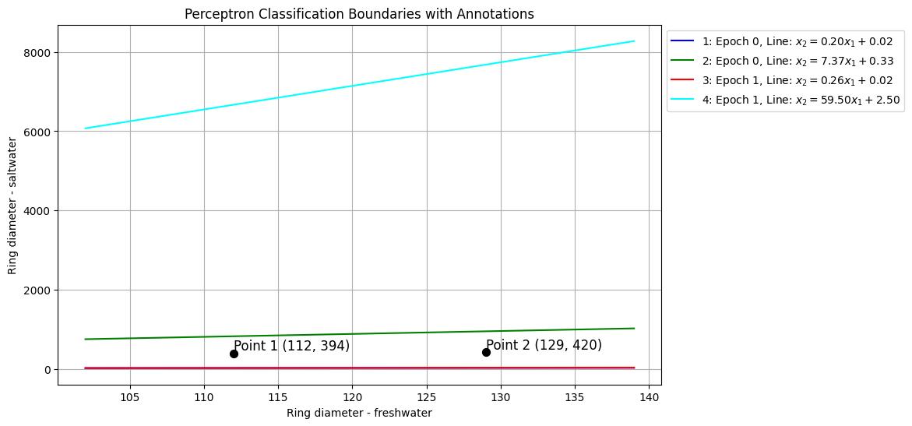
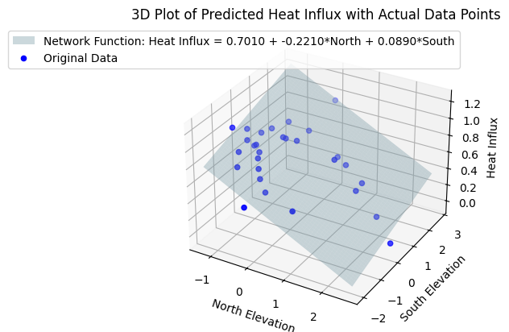
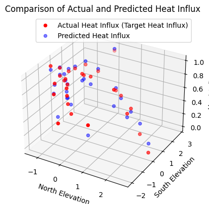
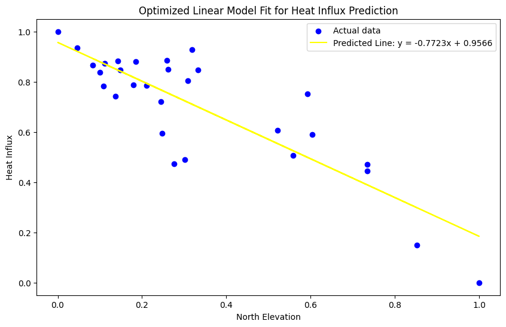
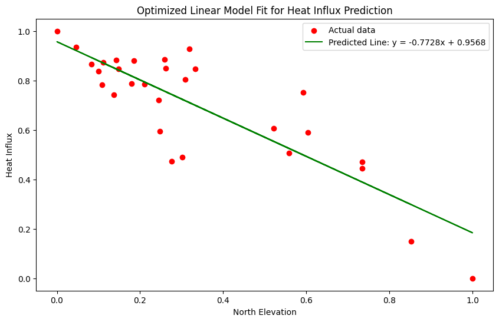

# Advanced Neural Network Applications

Practical implementations of perceptron and linear neuron models for classification and regression tasks, featuring step-by-step mathematical analysis and interactive visualizations in Jupyter notebooks.

[](LICENSE)
[](https://python.org)
[](https://jupyter.org)
[](https://mybinder.org/v2/gh/ChanMeng666/advanced-neural-network-applications/main)

## Overview

This repository demonstrates foundational neural network architectures through hands-on implementations. It covers two core model types:

- **Perceptron** — binary classification of fish species (Canadian vs. Alaskan) using step activation functions and iterative weight updates
- **Linear Neuron** — regression for predicting building heat influx from elevation measurements, using gradient descent optimization

Each notebook includes detailed mathematical derivations, step-by-step weight update calculations, and comprehensive visualizations to build intuition for how these models learn.

## Visualizations

<div align="center">
  
  <p><em>Perceptron classification boundaries for fish species identification</em></p>
</div>

<div align="center">
  
  <p><em>3D surface plot of predicted heat influx with actual data points</em></p>
</div>

<details>
<summary>More visualizations</summary>

<div align="center">
  
  <p><em>Comparison of actual and predicted heat influx values</em></p>
</div>

<div align="center">
  
  <p><em>Detailed comparison analysis of heat influx predictions</em></p>
</div>

<div align="center">
  
  <p><em>Optimized linear model fit for heat influx prediction</em></p>
</div>

<div align="center">
  
  <p><em>Enhanced linear model optimization results</em></p>
</div>

</details>

## Try It Online

You can run all notebooks directly in your browser — no local installation required:

- **Binder** — launch the full interactive environment:
  [](https://mybinder.org/v2/gh/ChanMeng666/advanced-neural-network-applications/main?labpath=notebooks)
- **Google Colab** — open individual notebooks via the links in the table below.

## Notebooks

| # | Notebook | Topic | Description | Colab |
|---|----------|-------|-------------|-------|
| 1 | [01-perceptron-basics](notebooks/01-perceptron-basics.ipynb) | Perceptron | Binary classification with fish species data, weight initialization, activation functions | [](https://colab.research.google.com/github/ChanMeng666/advanced-neural-network-applications/blob/main/notebooks/01-perceptron-basics.ipynb) |
| 2 | [02-perceptron-analysis](notebooks/02-perceptron-analysis.ipynb) | Perceptron | Mathematical analysis, convergence proofs, classification boundary visualization | [](https://colab.research.google.com/github/ChanMeng666/advanced-neural-network-applications/blob/main/notebooks/02-perceptron-analysis.ipynb) |
| 3 | [03-linear-neuron-single-input](notebooks/03-linear-neuron-single-input.ipynb) | Linear Neuron | Single-input regression predicting heat influx from north elevation | [](https://colab.research.google.com/github/ChanMeng666/advanced-neural-network-applications/blob/main/notebooks/03-linear-neuron-single-input.ipynb) |
| 4 | [04-linear-neuron-optimization](notebooks/04-linear-neuron-optimization.ipynb) | Optimization | Learning rate tuning, gradient descent, convergence analysis | [](https://colab.research.google.com/github/ChanMeng666/advanced-neural-network-applications/blob/main/notebooks/04-linear-neuron-optimization.ipynb) |
| 5 | [05-linear-neuron-multi-input](notebooks/05-linear-neuron-multi-input.ipynb) | Linear Neuron | Multi-input regression using north and south elevation measurements | [](https://colab.research.google.com/github/ChanMeng666/advanced-neural-network-applications/blob/main/notebooks/05-linear-neuron-multi-input.ipynb) |
| 6 | [06-linear-neuron-validation](notebooks/06-linear-neuron-validation.ipynb) | Validation | Model validation and testing procedures | [](https://colab.research.google.com/github/ChanMeng666/advanced-neural-network-applications/blob/main/notebooks/06-linear-neuron-validation.ipynb) |
| 7 | [07-linear-neuron-3d-visualization](notebooks/07-linear-neuron-3d-visualization.ipynb) | Visualization | Interactive 3D prediction surface rendering | [](https://colab.research.google.com/github/ChanMeng666/advanced-neural-network-applications/blob/main/notebooks/07-linear-neuron-3d-visualization.ipynb) |

**Recommended learning path:** Start with notebook 01, then progress sequentially through the series.

## Datasets

### Fish Classification (`data/fish_data.csv`)

Binary classification dataset with 94 fish measurements:
- **Features:** freshwater ring diameter, saltwater ring diameter
- **Target:** species label (0 = Canadian, 1 = Alaskan)

### Heat Influx (`data/heat_influx_north_south.csv`)

Regression dataset with 29 building observations:
- **Features:** north and south elevation measurements
- **Target:** heat influx (continuous)

## Getting Started

### Prerequisites

- Python 3.x
- pip (Python package manager)

### Installation

```bash
git clone https://github.com/ChanMeng666/advanced-neural-network-applications.git
cd advanced-neural-network-applications
pip install -r requirements.txt
```

### Running the Notebooks

```bash
jupyter notebook
# or
jupyter lab
```

Then open any notebook from the `notebooks/` directory. Notebooks load data using relative paths, so they should work out of the box when launched from the project root.

## Project Structure

```
advanced-neural-network-applications/
├── notebooks/
│   ├── 01-perceptron-basics.ipynb
│   ├── 02-perceptron-analysis.ipynb
│   ├── 03-linear-neuron-single-input.ipynb
│   ├── 04-linear-neuron-optimization.ipynb
│   ├── 05-linear-neuron-multi-input.ipynb
│   ├── 06-linear-neuron-validation.ipynb
│   └── 07-linear-neuron-3d-visualization.ipynb
├── data/
│   ├── fish_data.csv
│   └── heat_influx_north_south.csv
├── images/
│   └── (visualization outputs)
├── requirements.txt
├── LICENSE
├── CODE_OF_CONDUCT.md
└── README.md
```

## Tech Stack

- **Python** — implementation language
- **Jupyter Notebook** — interactive development environment
- **NumPy** — numerical computing and matrix operations
- **Pandas** — data loading and manipulation
- **Matplotlib** — plotting and visualization
- **Scikit-learn** — evaluation metrics and utilities

## Contributing

Contributions are welcome. Please open an issue first to discuss proposed changes.

1. Fork the repository
2. Create a feature branch (`git checkout -b feature/your-feature`)
3. Commit your changes
4. Push to the branch and open a pull request

See [CODE_OF_CONDUCT.md](CODE_OF_CONDUCT.md) for community guidelines.

## License

This project is licensed under the [MIT License](LICENSE).

## Author

**Chan Meng** — [GitHub](https://github.com/ChanMeng666) · [LinkedIn](https://www.linkedin.com/in/chanmeng666/) · [Website](https://chanmeng.live/)
