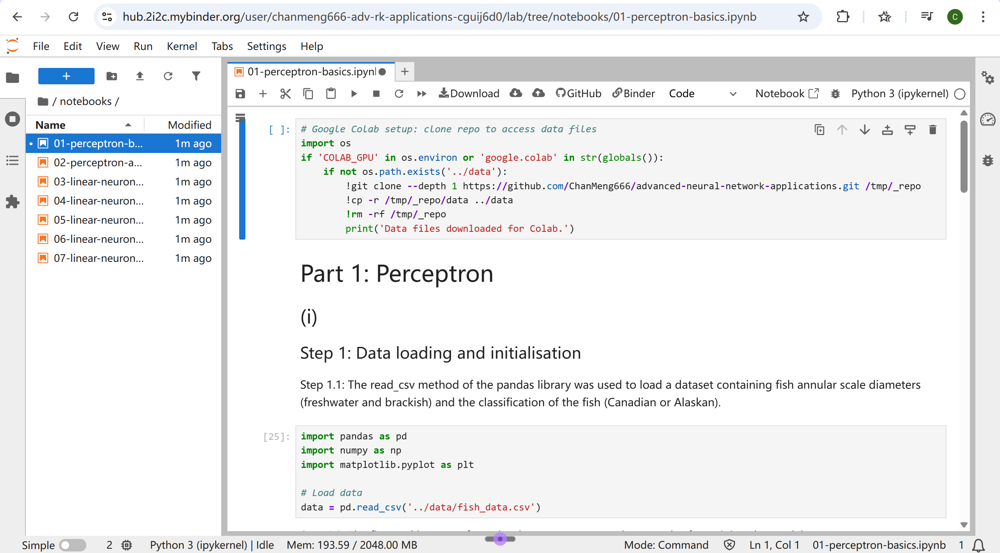

<div align="center"><a name="readme-top"></a>

# 🧠 Advanced Neural Network Applications<br/><h3>Perceptron & Linear Neuron Models from Scratch</h3>

Practical implementations of perceptron and linear neuron models for classification and regression tasks,<br/>
featuring step-by-step mathematical analysis and interactive visualizations in Jupyter notebooks.<br/>
Run everything in your browser with **Binder** or **Google Colab** — no installation required.

[![][github-stars-shield]][github-stars-link]
[![][github-forks-shield]][github-forks-link]
[![][github-issues-shield]][github-issues-link]
[![][github-license-shield]][github-license-link]
[![][github-contributors-shield]][github-contributors-link]
[![][github-releasedate-shield]][github-releasedate-link]

**Tech Stack:**


<p align="center">
  <a href="https://github.com/ChanMeng666/advanced-neural-network-applications/stargazers">
    
  </a>
  &nbsp;
  <a href="https://buymeacoffee.com/chanmeng66u">
    
  </a>
</p>

**Share This Project**

[![][share-x-shield]][share-x-link]
[![][share-telegram-shield]][share-telegram-link]
[![][share-whatsapp-shield]][share-whatsapp-link]
[![][share-reddit-shield]][share-reddit-link]
[![][share-weibo-shield]][share-weibo-link]
[![][share-mastodon-shield]][share-mastodon-link]
[![][share-linkedin-shield]][share-linkedin-link]

<sup>Building intuition for neural networks through hands-on implementations and mathematical analysis.</sup>

</div>

> [!IMPORTANT]
> This project demonstrates foundational neural network architectures through hands-on implementations. It covers **perceptron** models for binary classification and **linear neuron** models for regression, with detailed mathematical derivations, step-by-step weight update calculations, and comprehensive visualizations.

<details>
<summary><kbd>📑 Table of Contents</kbd></summary>

#### TOC

- [🌟 Introduction](#-introduction)
- [✨ Key Features](#-key-features)
  - [`1` Perceptron Classification](#1-perceptron-classification)
  - [`2` Linear Neuron Regression](#2-linear-neuron-regression)
  - [`*` Additional Features](#-additional-features)
- [📊 Visualizations](#-visualizations)
- [🛠️ Tech Stack](#️-tech-stack)
- [🚀 Try It Online](#-try-it-online)
- [📚 Notebooks](#-notebooks)
- [📁 Datasets](#-datasets)
- [💻 Getting Started](#-getting-started)
- [📂 Project Structure](#-project-structure)
- [🤝 Contributing](#-contributing)
- [❤️ Sponsor](#️-sponsor)
- [📄 License](#-license)
- [🙋‍♀️ Author](#️-author)

####

<br/>

</details>

<!-- ═══════════════════════════════════════════════════════════════════════════
     SECTION: Introduction
     ═══════════════════════════════════════════════════════════════════════════ -->

## 🌟 Introduction

<table>
<tr>
<td>

<h4>About This Project</h4>

This repository provides a comprehensive, hands-on introduction to foundational neural network architectures. Through carefully structured Jupyter notebooks, you'll build perceptron and linear neuron models from scratch, understanding every mathematical step along the way.

Whether you're a student learning machine learning for the first time or an educator looking for teaching materials, these notebooks offer clear explanations, reproducible code, and rich visualizations that bring the theory to life.

<h4>What You'll Learn</h4>

- How perceptrons classify data using step activation functions and iterative weight updates
- How linear neurons perform regression using gradient descent optimization
- The mathematics behind convergence, learning rates, and decision boundaries
- How to visualize model behavior in 2D and 3D

</td>
</tr>
</table>

> [!NOTE]
> - Python 3.x required
> - No GPU needed — all models run on CPU
> - Zero-install option available via Binder and Google Colab

> [!TIP]
> **⭐ Star us** to receive all release notifications from GitHub without delay!

<details>
  <summary><kbd>⭐ Star History</kbd></summary>
  <picture>
    <source media="(prefers-color-scheme: dark)" srcset="https://api.star-history.com/svg?repos=ChanMeng666%2Fadvanced-neural-network-applications&theme=dark&type=Date">
    
  </picture>
</details>

<div align="right">

[![][back-to-top]](#readme-top)

</div>

<!-- ═══════════════════════════════════════════════════════════════════════════
     SECTION: Key Features
     ═══════════════════════════════════════════════════════════════════════════ -->

## ✨ Key Features

### `1` Perceptron Classification

Binary classification of fish species (Canadian vs. Alaskan) using step activation functions and iterative weight updates. Includes convergence proofs and classification boundary visualization.

<div align="center">
  
  <p><em>Perceptron classification boundaries for fish species identification</em></p>
</div>

Key capabilities include:
- 🐟 **Fish Species Classification**: Distinguish Canadian from Alaskan fish using ring diameter measurements
- 📐 **Mathematical Derivations**: Step-by-step weight update calculations with full working
- 📈 **Convergence Analysis**: Proof of convergence and boundary evolution visualization
- 🎯 **Decision Boundaries**: Interactive plotting of classification boundaries

[![][back-to-top]](#readme-top)

### `2` Linear Neuron Regression

Regression for predicting building heat influx from elevation measurements, using gradient descent optimization. Progresses from single-input to multi-input models with 3D visualization.

<div align="center">
  
  <p><em>3D surface plot of predicted heat influx with actual data points</em></p>
</div>

Key capabilities include:
- 🏗️ **Heat Influx Prediction**: Predict building heat influx from north and south elevation data
- 📉 **Gradient Descent**: Learning rate tuning and convergence analysis
- 🔄 **Single & Multi-Input**: Progressive complexity from 1D to 2D feature spaces
- 🌐 **3D Visualization**: Interactive prediction surface rendering

[![][back-to-top]](#readme-top)

### `*` Additional Features

Beyond the core models, this project includes:

- [x] 📝 **Detailed Math**: Complete mathematical derivations for every weight update step
- [x] 🎓 **Structured Learning Path**: 7 notebooks in recommended sequential order
- [x] ☁️ **Zero Installation**: Run everything in Binder or Google Colab
- [x] 📊 **Rich Visualizations**: 2D plots, 3D surfaces, and comparison charts
- [x] ✅ **Model Validation**: Testing procedures and accuracy evaluation
- [x] 🔧 **Optimization Analysis**: Learning rate tuning and convergence studies
- [x] 📂 **Clean Datasets**: Well-documented CSV files ready for exploration

> ✨ An ideal resource for learning the foundations of neural networks.

<div align="right">

[![][back-to-top]](#readme-top)

</div>

<!-- ═══════════════════════════════════════════════════════════════════════════
     SECTION: Visualizations
     ═══════════════════════════════════════════════════════════════════════════ -->

## 📊 Visualizations

<div align="center">
  <table>
    <tr>
      <td width="50%" align="center">
        
        <br/><em>Perceptron Classification Boundaries</em>
      </td>
      <td width="50%" align="center">
        
        <br/><em>3D Predicted Heat Influx Surface</em>
      </td>
    </tr>
  </table>
</div>

<details>
<summary><kbd>📈 More Visualizations</kbd></summary>

<div align="center">
  <table>
    <tr>
      <td width="50%" align="center">
        
        <br/><em>Actual vs Predicted Heat Influx</em>
      </td>
      <td width="50%" align="center">
        
        <br/><em>Detailed Comparison Analysis</em>
      </td>
    </tr>
    <tr>
      <td width="50%" align="center">
        
        <br/><em>Optimized Linear Model Fit</em>
      </td>
      <td width="50%" align="center">
        
        <br/><em>Enhanced Optimization Results</em>
      </td>
    </tr>
  </table>
</div>

</details>

<div align="right">

[![][back-to-top]](#readme-top)

</div>

<!-- ═══════════════════════════════════════════════════════════════════════════
     SECTION: Tech Stack
     ═══════════════════════════════════════════════════════════════════════════ -->

## 🛠️ Tech Stack

<div align="center">
  <table>
    <tr>
      <td align="center" width="96">
        
        <br>Python 3.x
      </td>
      <td align="center" width="96">
        
        <br>Jupyter
      </td>
      <td align="center" width="96">
        
        <br>NumPy
      </td>
      <td align="center" width="96">
        
        <br>Pandas
      </td>
      <td align="center" width="96">
        <a href="https://matplotlib.org"></a>
        <br>Matplotlib
      </td>
      <td align="center" width="96">
        
        <br>Scikit-learn
      </td>
    </tr>
  </table>
</div>

- **Python** — implementation language
- **Jupyter Notebook** — interactive development environment
- **NumPy** — numerical computing and matrix operations
- **Pandas** — data loading and manipulation
- **Matplotlib** — plotting and visualization
- **Scikit-learn** — evaluation metrics and utilities

<div align="right">

[![][back-to-top]](#readme-top)

</div>

<!-- ═══════════════════════════════════════════════════════════════════════════
     SECTION: Try It Online
     ═══════════════════════════════════════════════════════════════════════════ -->

## 🚀 Try It Online

You can run all notebooks directly in your browser — no local installation required:

<div align="center">

[](https://mybinder.org/v2/gh/ChanMeng666/advanced-neural-network-applications/main?labpath=notebooks)
&nbsp;&nbsp;
[](https://colab.research.google.com/github/ChanMeng666/advanced-neural-network-applications/blob/main/notebooks/01-perceptron-basics.ipynb)

</div>

- **Binder** — launch the full interactive environment with all notebooks
- **Google Colab** — open individual notebooks via the links in the [Notebooks](#-notebooks) table below

<div align="center">
  
  <p><em>Running notebooks interactively on Binder</em></p>
</div>

<div align="right">

[![][back-to-top]](#readme-top)

</div>

<!-- ═══════════════════════════════════════════════════════════════════════════
     SECTION: Notebooks
     ═══════════════════════════════════════════════════════════════════════════ -->

## 📚 Notebooks

| # | Notebook | Topic | Description | Colab |
|---|----------|-------|-------------|-------|
| 1 | [01-perceptron-basics](notebooks/01-perceptron-basics.ipynb) | Perceptron | Binary classification with fish species data, weight initialization, activation functions | [](https://colab.research.google.com/github/ChanMeng666/advanced-neural-network-applications/blob/main/notebooks/01-perceptron-basics.ipynb) |
| 2 | [02-perceptron-analysis](notebooks/02-perceptron-analysis.ipynb) | Perceptron | Mathematical analysis, convergence proofs, classification boundary visualization | [](https://colab.research.google.com/github/ChanMeng666/advanced-neural-network-applications/blob/main/notebooks/02-perceptron-analysis.ipynb) |
| 3 | [03-linear-neuron-single-input](notebooks/03-linear-neuron-single-input.ipynb) | Linear Neuron | Single-input regression predicting heat influx from north elevation | [](https://colab.research.google.com/github/ChanMeng666/advanced-neural-network-applications/blob/main/notebooks/03-linear-neuron-single-input.ipynb) |
| 4 | [04-linear-neuron-optimization](notebooks/04-linear-neuron-optimization.ipynb) | Optimization | Learning rate tuning, gradient descent, convergence analysis | [](https://colab.research.google.com/github/ChanMeng666/advanced-neural-network-applications/blob/main/notebooks/04-linear-neuron-optimization.ipynb) |
| 5 | [05-linear-neuron-multi-input](notebooks/05-linear-neuron-multi-input.ipynb) | Linear Neuron | Multi-input regression using north and south elevation measurements | [](https://colab.research.google.com/github/ChanMeng666/advanced-neural-network-applications/blob/main/notebooks/05-linear-neuron-multi-input.ipynb) |
| 6 | [06-linear-neuron-validation](notebooks/06-linear-neuron-validation.ipynb) | Validation | Model validation and testing procedures | [](https://colab.research.google.com/github/ChanMeng666/advanced-neural-network-applications/blob/main/notebooks/06-linear-neuron-validation.ipynb) |
| 7 | [07-linear-neuron-3d-visualization](notebooks/07-linear-neuron-3d-visualization.ipynb) | Visualization | Interactive 3D prediction surface rendering | [](https://colab.research.google.com/github/ChanMeng666/advanced-neural-network-applications/blob/main/notebooks/07-linear-neuron-3d-visualization.ipynb) |

**Recommended learning path:** Start with notebook 01, then progress sequentially through the series.

<div align="right">

[![][back-to-top]](#readme-top)

</div>

<!-- ═══════════════════════════════════════════════════════════════════════════
     SECTION: Datasets
     ═══════════════════════════════════════════════════════════════════════════ -->

## 📁 Datasets

### Fish Classification (`data/fish_data.csv`)

Binary classification dataset with 94 fish measurements:
- **Features:** freshwater ring diameter, saltwater ring diameter
- **Target:** species label (0 = Canadian, 1 = Alaskan)

### Heat Influx (`data/heat_influx_north_south.csv`)

Regression dataset with 29 building observations:
- **Features:** north and south elevation measurements
- **Target:** heat influx (continuous)

<div align="right">

[![][back-to-top]](#readme-top)

</div>

<!-- ═══════════════════════════════════════════════════════════════════════════
     SECTION: Getting Started
     ═══════════════════════════════════════════════════════════════════════════ -->

## 💻 Getting Started

> [!TIP]
> Prefer not to install anything? Use [Binder](https://mybinder.org/v2/gh/ChanMeng666/advanced-neural-network-applications/main?labpath=notebooks) or [Google Colab](#-notebooks) to run notebooks directly in your browser.

### Prerequisites

- Python 3.x ([Download](https://python.org))
- pip (Python package manager)
- Git ([Download](https://git-scm.com))

### Installation

```bash
git clone https://github.com/ChanMeng666/advanced-neural-network-applications.git
cd advanced-neural-network-applications
pip install -r requirements.txt
```

### Running the Notebooks

```bash
jupyter notebook
# or
jupyter lab
```

Then open any notebook from the `notebooks/` directory. Notebooks load data using relative paths, so they work out of the box when launched from the project root.

<div align="right">

[![][back-to-top]](#readme-top)

</div>

<!-- ═══════════════════════════════════════════════════════════════════════════
     SECTION: Project Structure
     ═══════════════════════════════════════════════════════════════════════════ -->

## 📂 Project Structure

```
advanced-neural-network-applications/
├── .github/
│   ├── FUNDING.yml
│   ├── ISSUE_TEMPLATE/
│   │   ├── bug_report.md
│   │   └── feature_request.md
│   └── workflows/
│       └── update-license-year.yml
├── data/
│   ├── fish_data.csv
│   └── heat_influx_north_south.csv
├── images/
│   └── (visualization outputs)
├── notebooks/
│   ├── 01-perceptron-basics.ipynb
│   ├── 02-perceptron-analysis.ipynb
│   ├── 03-linear-neuron-single-input.ipynb
│   ├── 04-linear-neuron-optimization.ipynb
│   ├── 05-linear-neuron-multi-input.ipynb
│   ├── 06-linear-neuron-validation.ipynb
│   └── 07-linear-neuron-3d-visualization.ipynb
├── CHANGELOG.md
├── CITATION.cff
├── CODE_OF_CONDUCT.md
├── CONTRIBUTING.md
├── LICENSE
├── PULL_REQUEST_TEMPLATE.md
├── README.md
├── SECURITY.md
├── SUPPORT.md
└── requirements.txt
```

<div align="right">

[![][back-to-top]](#readme-top)

</div>

<!-- ═══════════════════════════════════════════════════════════════════════════
     SECTION: Contributing
     ═══════════════════════════════════════════════════════════════════════════ -->

## 🤝 Contributing

Contributions are welcome! Here's how you can help improve this project:

1. Fork the repository
2. Create a feature branch (`git checkout -b feature/your-feature`)
3. Commit your changes
4. Push to the branch and open a pull request

Please read our [Contributing Guidelines](CONTRIBUTING.md) for detailed instructions and follow our [Code of Conduct](CODE_OF_CONDUCT.md). For security concerns, see [SECURITY.md](SECURITY.md). For help, see [SUPPORT.md](SUPPORT.md).

[![][pr-welcome-shield]][pr-welcome-link]

### Contributors

<a href="https://github.com/ChanMeng666/advanced-neural-network-applications/graphs/contributors">
  
</a>

<div align="right">

[![][back-to-top]](#readme-top)

</div>

<!-- ═══════════════════════════════════════════════════════════════════════════
     SECTION: Sponsor
     ═══════════════════════════════════════════════════════════════════════════ -->

## ❤️ Sponsor

If this project helped you learn, consider supporting its development!

<p align="center">
  <a href="https://github.com/ChanMeng666/advanced-neural-network-applications/stargazers">
    
  </a>
  &nbsp;&nbsp;
  <a href="https://buymeacoffee.com/chanmeng66u">
    
  </a>
</p>

<p align="center">
  <a href="https://buymeacoffee.com/chanmeng66u" target="_blank">
    
  </a>
</p>

### Thanks to all the kind people! 💖

**Stargazers**

<p align="center">
  <a href="https://github.com/ChanMeng666/advanced-neural-network-applications/stargazers">
    
  </a>
</p>

**Forkers**

<p align="center">
  <a href="https://github.com/ChanMeng666/advanced-neural-network-applications/network/members">
    
  </a>
</p>

<div align="right">

[![][back-to-top]](#readme-top)

</div>

<!-- ═══════════════════════════════════════════════════════════════════════════
     SECTION: License
     ═══════════════════════════════════════════════════════════════════════════ -->

## 📄 License

This project is licensed under the MIT License - see the [LICENSE](LICENSE) file for details.

<!-- ═══════════════════════════════════════════════════════════════════════════
     SECTION: Author
     ═══════════════════════════════════════════════════════════════════════════ -->

## 🙋‍♀️ Author

**Chan Meng**

<p>
  <a href="https://www.linkedin.com/in/chanmeng666/">
    
  </a>
  <a href="https://github.com/ChanMeng666">
    
  </a>
  <a href="mailto:chanmeng.dev@gmail.com">
    
  </a>
  <a href="https://chanmeng.org/">
    
  </a>
</p>

---

<div align="center">
<strong>🧠 Building Intuition for Neural Networks 🌟</strong>
<br/>
<em>Learn the fundamentals through hands-on implementations</em>
<br/><br/>

⭐ **Star us on GitHub** · 📖 **Read the Notebooks** · 🐛 **Report Issues** · 💡 **Request Features** · 🤝 **Contribute**

<br/>


</div>

---

<!-- LINK DEFINITIONS -->

[back-to-top]: https://img.shields.io/badge/-BACK_TO_TOP-151515?style=flat-square

<!-- GitHub Links -->
[github-stars-link]: https://github.com/ChanMeng666/advanced-neural-network-applications/stargazers
[github-forks-link]: https://github.com/ChanMeng666/advanced-neural-network-applications/forks
[github-issues-link]: https://github.com/ChanMeng666/advanced-neural-network-applications/issues
[github-license-link]: https://github.com/ChanMeng666/advanced-neural-network-applications/blob/main/LICENSE
[github-contributors-link]: https://github.com/ChanMeng666/advanced-neural-network-applications/contributors
[github-releasedate-link]: https://github.com/ChanMeng666/advanced-neural-network-applications
[pr-welcome-link]: https://github.com/ChanMeng666/advanced-neural-network-applications/pulls

<!-- Shield Badges -->
[github-stars-shield]: https://img.shields.io/github/stars/ChanMeng666/advanced-neural-network-applications?color=ffcb47&labelColor=black&style=flat-square
[github-forks-shield]: https://img.shields.io/github/forks/ChanMeng666/advanced-neural-network-applications?color=8ae8ff&labelColor=black&style=flat-square
[github-issues-shield]: https://img.shields.io/github/issues/ChanMeng666/advanced-neural-network-applications?color=ff80eb&labelColor=black&style=flat-square
[github-license-shield]: https://img.shields.io/badge/license-MIT-white?labelColor=black&style=flat-square
[github-contributors-shield]: https://img.shields.io/github/contributors/ChanMeng666/advanced-neural-network-applications?color=c4f042&labelColor=black&style=flat-square
[github-releasedate-shield]: https://img.shields.io/github/last-commit/ChanMeng666/advanced-neural-network-applications?labelColor=black&style=flat-square
[pr-welcome-shield]: https://img.shields.io/badge/🤝_PRs_welcome-%E2%86%92-ffcb47?labelColor=black&style=for-the-badge

<!-- Social Share Links -->
[share-x-link]: https://x.com/intent/tweet?hashtags=machinelearning%2Cneuralnetworks&text=Check%20out%20Advanced%20Neural%20Network%20Applications%20-%20Learn%20perceptron%20%26%20linear%20neuron%20models%20from%20scratch!&url=https%3A%2F%2Fgithub.com%2FChanMeng666%2Fadvanced-neural-network-applications
[share-telegram-link]: https://t.me/share/url?text=Learn%20neural%20networks%20from%20scratch%20with%20hands-on%20Jupyter%20notebooks&url=https%3A%2F%2Fgithub.com%2FChanMeng666%2Fadvanced-neural-network-applications
[share-whatsapp-link]: https://api.whatsapp.com/send?text=Check%20out%20this%20neural%20network%20learning%20project%20https%3A%2F%2Fgithub.com%2FChanMeng666%2Fadvanced-neural-network-applications
[share-reddit-link]: https://www.reddit.com/submit?title=Advanced%20Neural%20Network%20Applications%20-%20Learn%20Perceptron%20%26%20Linear%20Neuron%20from%20Scratch&url=https%3A%2F%2Fgithub.com%2FChanMeng666%2Fadvanced-neural-network-applications
[share-weibo-link]: http://service.weibo.com/share/share.php?title=Advanced%20Neural%20Network%20Applications&url=https%3A%2F%2Fgithub.com%2FChanMeng666%2Fadvanced-neural-network-applications
[share-mastodon-link]: https://mastodon.social/share?text=Learn%20neural%20networks%20from%20scratch%20https://github.com/ChanMeng666/advanced-neural-network-applications
[share-linkedin-link]: https://linkedin.com/sharing/share-offsite/?url=https://github.com/ChanMeng666/advanced-neural-network-applications

[share-x-shield]: https://img.shields.io/badge/-share%20on%20x-black?labelColor=black&logo=x&logoColor=white&style=flat-square
[share-telegram-shield]: https://img.shields.io/badge/-share%20on%20telegram-black?labelColor=black&logo=telegram&logoColor=white&style=flat-square
[share-whatsapp-shield]: https://img.shields.io/badge/-share%20on%20whatsapp-black?labelColor=black&logo=whatsapp&logoColor=white&style=flat-square
[share-reddit-shield]: https://img.shields.io/badge/-share%20on%20reddit-black?labelColor=black&logo=reddit&logoColor=white&style=flat-square
[share-weibo-shield]: https://img.shields.io/badge/-share%20on%20weibo-black?labelColor=black&logo=sinaweibo&logoColor=white&style=flat-square
[share-mastodon-shield]: https://img.shields.io/badge/-share%20on%20mastodon-black?labelColor=black&logo=mastodon&logoColor=white&style=flat-square
[share-linkedin-shield]: https://img.shields.io/badge/-share%20on%20linkedin-black?labelColor=black&logo=linkedin&logoColor=white&style=flat-square
